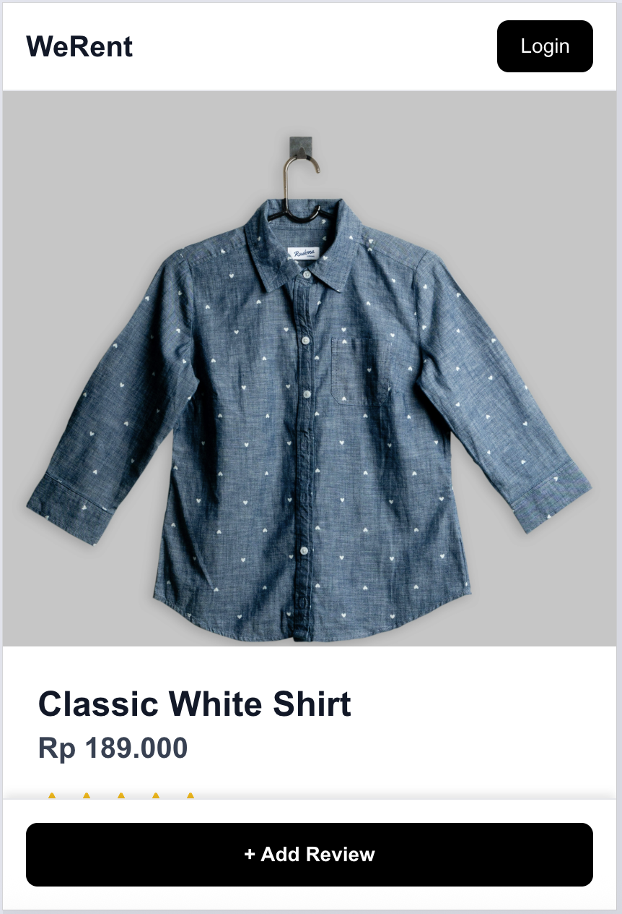
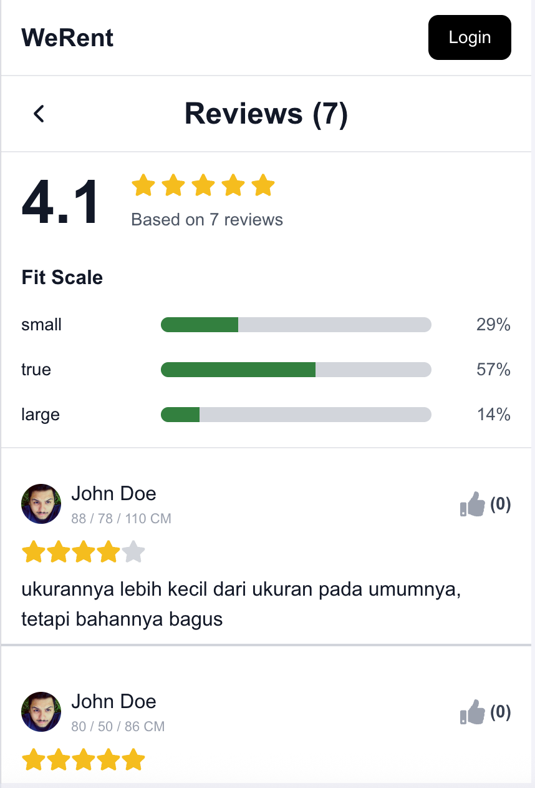

# WeRent
A simple and modern clothing rental platform built with **Next.js**, **TypeScript**, and **TailwindCSS**.

---

## 🚀 Features

### 🧑‍🤝‍🧑 Authentication  
- Login system for users  
- Protected actions (e.g., submitting reviews)

### 👚 Product  
- Product detail page with:
  - Price  
  - Description  
  - Available sizes  
  - Average rating  
  - Fit scale summary  

### ⭐ Review System  
Users can:
- Add rating (1–5 stars)
- Write detailed comments  
- Choose **fit type** (Runs Small, True to Size, Runs Large)  
- Input measurements (Waist, Bust, Hips)  
- See other users' reviews  
- View aggregated fit statistics  

### 📊 Fit Scale Visualization  
- Fit categories (small / true / large)  
- Percentage bars showing distribution based on user reviews  

---

## 🛠 Tech Stack

| Layer       | Technology |
|-------------|------------|
| Frontend    | Next.js 14, React |
| Styling     | TailwindCSS |
| Language    | TypeScript |
| Icons/Components | Lucide React |

---

## ⚙️ Setup & Installation

### 1. Clone Repository

```bash
git clone https://github.com/mytreatzz/werent-fe.git
cd werent-fe
```

### 2. Install Dependencies

```bash
npm install
# or
pnpm install
```

### 3. Setup Environment

```bash
NEXT_PUBLIC_API_URL=
```

### 4. Run Development Server

```bash
npm run dev
```

## 🔗 Demo  
Live Demo: **https://werent-fe.vercel.app/**  

---

## 📸 Screenshots

### 🛍 Product Detail Page  


### 📝 Write a Review  


### ⭐ Reviews Page  


